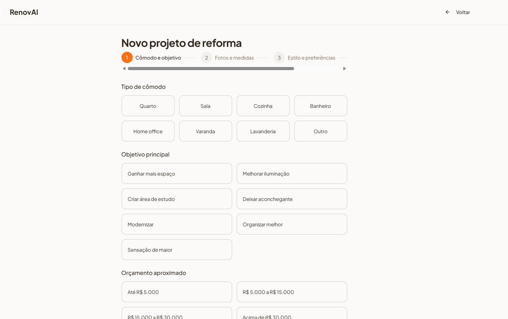
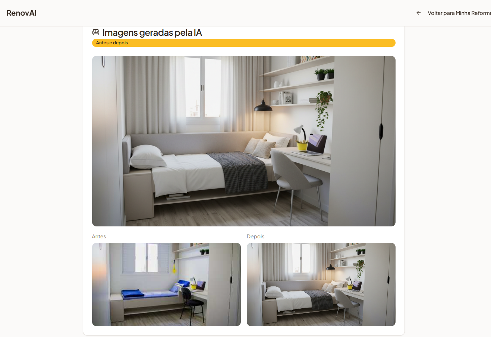
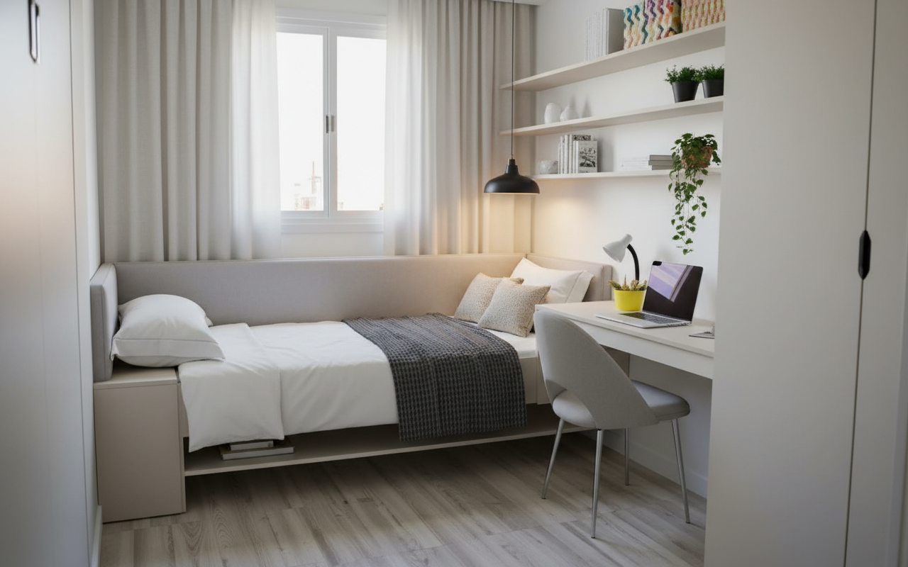
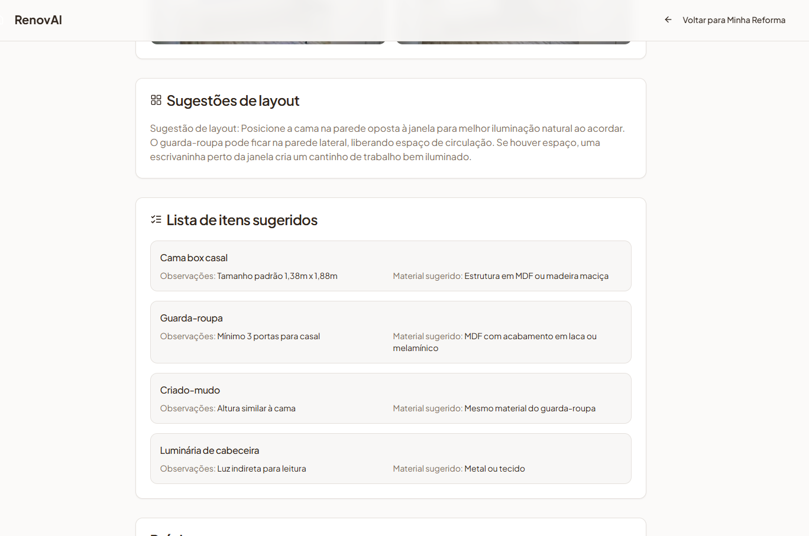
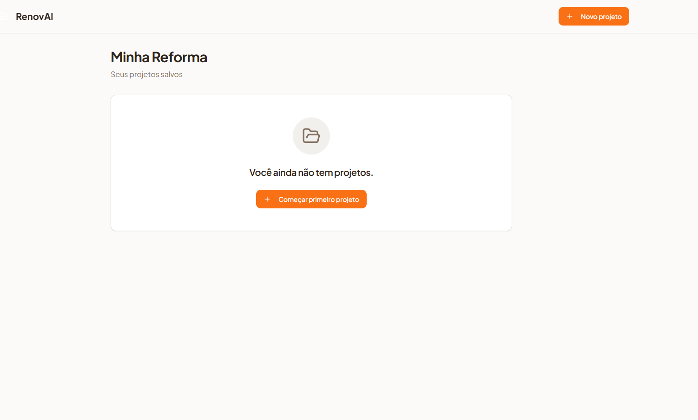

# RenovAI: An AI-Assisted Platform for Home Renovation Decision Support Using Generative Models and Extended Reality

**Bruno Wasserstein**

Advisor: Prof. Murilo Zanini de Carvalho

Academic Project — Entrepreneurship Track
April 2026

---

## Abstract

The residential renovation sector in Brazil is characterized by high consumer uncertainty, fragmented information, and significant gaps between aesthetic inspiration and practical execution. This paper presents RenovAI, an applied research project that combines generative artificial intelligence, augmented reality, and embedding-based visual retrieval to support non-professional consumers throughout the light home renovation planning journey. The platform was developed through an iterative, applied research methodology guided by proprietary market data collected from 117 respondents in Brazil's South and Southeast regions. The paper details the theoretical foundations underlying the technological choices, the development methodology, the platform's current functional state, its business plan, and its market sizing through TAM, SAM, and SOM analysis. The results indicate strong market alignment and a technically feasible solution architecture that bridges the gap between generative design ideation and real-world product acquisition.

**Keywords:** generative artificial intelligence, augmented reality, home renovation, decision support, interior design, extended reality, Brazilian retail market.

---

## Table of Contents

1. Introduction
2. Theoretical Framework
3. Methodology
4. Results
5. Business Plan
6. Final Considerations
7. References
8. Appendix

---

## 1. Introduction

### 1.1 The Renovation Paradox in Contemporary Consumer Culture

The contemporary home has been repositioned as a central site of personal identity, comfort, and social signaling. Across income segments in Brazil, the renovation and interior decoration market has experienced sustained growth, driven by pandemic-era behavioral shifts that increased the time people spent at home, a maturing digital commerce infrastructure, and rising aspirations within the expanding middle class. Industry data places the Brazilian home goods and decoration sector at approximately R$96 billion to R$102 billion in annual transactional volume (ABCASA, 2024), with the segment having established itself as the third-largest category within the national e-commerce ecosystem (E-Commerce Brasil, 2024).

Despite this robust market backdrop, the consumer experience of planning and executing a light home renovation remains deeply fragmented and anxiety-inducing. Consumers are surrounded by an unprecedented volume of visual inspiration through platforms such as Pinterest, Instagram, and YouTube, yet they consistently report difficulty translating that inspiration into actionable, confident decisions. The gap between what a person imagines for a room and what they are able to execute with existing tools is not primarily a gap of desire or financial capacity. It is a gap of decision support.

This paradox sits at the heart of the problem RenovAI addresses. The abundance of visual content has not simplified the renovation journey; it has complicated it by raising expectations without providing tools for practical resolution. A consumer who browses hundreds of bedroom images on Instagram can accumulate strong aesthetic preferences while remaining entirely uncertain about whether a particular sofa will fit their room, whether a paint color will work with their lighting, or whether a set of products they admire is stylistically coherent or commercially available.

### 1.2 The Problem: Decision Uncertainty in Light Renovation

A proprietary survey conducted in February 2025 with 117 respondents from socioeconomic classes A, B, and the upper layer of C in Brazil's South and Southeast regions quantified the dimensions of this problem. The data revealed that 78 percent of respondents reported recurring difficulties with delays in renovation project delivery, while 61 percent expressed fear of spending beyond their planned budget. Perhaps most revealing from a platform design perspective, 68 percent of consumers stated they rely exclusively on friends and family recommendations when selecting professionals or making high-stakes renovation decisions, which indicates a profound lack of trust in the existing digital infrastructure designed to support these choices.

The survey further identified three primary clusters of consumer pain. The first is spatial uncertainty, meaning the inability to pre-visualize how a piece of furniture, a color, or a decorative element will look in one's actual space before committing to a purchase. The second is selection paralysis, which refers to the cognitive overload produced by an enormous catalog of options without adequate guidance or filtering tools aligned with the individual's constraints. The third is professional access asymmetry, meaning that the guidance of a trained interior designer or architect is perceived as expensive, exclusive, and inaccessible to the broader population of people making renovation decisions independently.

Each of these pain points points toward the same underlying problem: the renovation planning process is poorly served by current digital tools. Traditional platforms for home decoration inspiration are not designed to help consumers resolve decisions; they are designed to generate more inspiration. Marketplace platforms surface products without spatial context. Professional design software demands technical literacy that lay users do not possess. The result is a consumer who is rich in images and poor in guidance.

### 1.3 The Technology Opportunity

At the same time that this consumer pain persists, a convergence of technological developments has made it tractable in a way that was not previously possible. Three technological pillars underpin this opportunity.

The first is the maturation of generative artificial intelligence models capable of producing photorealistic images of interior spaces from natural language descriptions or user-uploaded reference images. Models such as those developed by Google and OpenAI have reached a quality threshold where they can generate spatially coherent, aesthetically compelling room visualizations that are genuinely useful for decision-making rather than merely entertaining.

The second is the widespread availability of augmented reality capabilities in mainstream consumer smartphones through frameworks such as ARKit on iOS and ARCore on Android. These frameworks allow applications to detect flat surfaces, estimate spatial dimensions, and overlay virtual objects into a live camera feed at sufficient quality to enable a consumer to realistically preview how a piece of furniture would look in their room before purchasing it.

The third is the emergence of embedding-based visual retrieval systems that can encode a furniture product's visual properties into a compact vector representation and then retrieve the most visually similar real products from a commercial catalog in response to a generated image or a user-provided reference. This technique bridges the inherent gap between the idealized outputs of generative models and the constrained reality of what is actually available for purchase.

The convergence of these three pillars creates a new class of opportunity: an intelligent renovation planning assistant that can receive a user's spatial context, aesthetic preferences, and practical constraints, generate design proposals, allow virtual visualization in the real space, and connect the result to real, purchasable products through established retail partners.

### 1.4 Scope and Objectives

RenovAI is positioned as a response to this convergence. The platform is designed not as a professional design tool, a construction management system, or a generalist marketplace. Its role is narrower and for that reason more immediately relevant: it acts as an intelligent planning companion for consumers undertaking light home renovation, defined as the renewal of furniture, decoration, and ambient elements without structural construction work.

The geographic focus of the initial phase is Brazil's South and Southeast regions, where digital maturity is high, the density of retail specialization is greatest, and the concentration of the target socioeconomic segments is strongest. The primary channel is mobile-first, reflecting the fact that approximately 85 percent of the Brazilian internet population accesses digital services via smartphone (NIC.br, 2024).

This paper documents the research trajectory, design decisions, technological foundations, and business logic of RenovAI's first development phase. It is structured as follows. Section two establishes the theoretical framework covering generative AI architectures, extended reality technologies, and consumer decision support theory. Section three describes the applied research methodology followed during development. Section four presents the platform results and visual evidence of the current functional state. Section five articulates the business plan. Section six offers final considerations and directions for the next development phase.

---

## 2. Theoretical Framework

### 2.1 Generative Artificial Intelligence in Spatial Design

Generative artificial intelligence refers to a family of machine learning architectures capable of producing novel content including text, images, audio, and three-dimensional structures by learning latent representations of large-scale training datasets. Within the context of spatial design and interior environments, three generative paradigms are particularly relevant.

Generative Adversarial Networks (GANs), introduced by Goodfellow et al. (2014), established the foundational framework for learning implicit distributions over data through the adversarial training of a generator and a discriminator network. In interior design applications, GAN architectures have been employed for tasks such as style transfer between room images, floor plan generation, and furniture placement optimization. However, GAN training instability and the tendency toward mode collapse limited their scalability in production applications (Brock et al., 2019).

Diffusion models represent the current state of the art in image synthesis quality. These models learn to reverse a gradual noising process applied to training images, allowing them to generate new samples by iteratively denoising random noise conditioned on textual or visual inputs. Architectures such as Stable Diffusion (Rombach et al., 2022) and those powering Google's Imagen and Gemini image generation capabilities demonstrated that diffusion-based models could produce high-fidelity, photorealistic images from textual descriptions with far greater stability and controllability than prior GAN approaches. In the context of interior design, diffusion models have been shown to generate room visualizations of sufficient realism to meaningfully influence consumer spatial judgment (Jang et al., 2025).

Transformer-based multimodal models, exemplified by the GPT-4 Vision and Gemini families, extend the generative paradigm to simultaneous understanding and generation across modalities. These models can receive as input a photograph of a room together with a natural language renovation brief, reason about spatial relationships and aesthetic coherence, and produce both descriptive analysis and modified visual proposals. This capability is particularly relevant for RenovAI's use case because it enables a conversational interface where the system interprets the consumer's context before generating recommendations.

Jang et al. (2025) conducted a systematic review of generative AI applications in architectural design and found that diffusion models and transformer-based architectures dominate recent publications, with their application accelerating substantially in the schematic and conceptual design phases. Importantly, the review identified a persistent gap between these tools' capacity for professional design ideation and their integration into consumer-facing, non-professional decision support workflows, which is precisely the gap that RenovAI targets.

### 2.2 Augmented Reality and Virtual Reality: Architectures and Retail Applications

Extended reality (XR) is an umbrella term encompassing augmented reality (AR), virtual reality (VR), and mixed reality (MR). Each technology represents a distinct position on the reality-virtuality continuum defined by Milgram and Kishino (1994), ranging from fully physical environments augmented with digital overlays to fully immersive synthetic environments.

Augmented reality, as implemented through mobile frameworks such as ARKit (Apple) and ARCore (Google), relies on simultaneous localization and mapping (SLAM) algorithms to estimate the geometry and orientation of the physical environment from camera sensor data. Plane detection identifies horizontal and vertical surfaces. Image tracking anchors virtual content to specific visual markers. Depth sensing through LiDAR sensors, available in higher-end devices, provides more precise geometric understanding of the environment, enabling realistic occlusion rendering where virtual furniture can be correctly placed behind real objects.

For furniture retail applications, AR has evolved from simple overlay experiences toward scale-accurate, physics-aware placement systems. The IKEA Place application, launched in 2017, demonstrated that consumers would adopt AR visualization for high-consideration furniture purchases when the experience was sufficiently realistic and embedded in a familiar retail flow. Subsequent adoption by Wayfair, Amazon, and Houzz extended this pattern at scale. Empirical results from these deployments indicate conversion rate uplifts of approximately 20 to 50 percent in AR-enabled product views, with Wayfair reporting conversion rates approximately three times higher for products viewed in AR and session durations 50 percent longer than those for non-AR sessions (MDPI, 2024; Frontiers, 2024). Houzz reported that users who engaged with AR features were 11 times more likely to make a purchase.

Return rate reduction is perhaps the most commercially significant outcome documented in the literature. IKEA and Wayfair have both reported return rates below 2 percent for AR-supported product categories, compared to baseline rates of 4 to 5 percent for furniture generally. This reduction reflects the improved fit between consumer expectation and product reality enabled by pre-purchase spatial visualization.

Virtual reality differs from augmented reality in its immersive architecture. VR headsets replace the user's visual field entirely with a synthetic environment, enabling a level of spatial presence and design exploration that is not achievable through a smartphone AR session. In retail contexts, VR has primarily been deployed in showroom environments where dedicated headsets allow prospective buyers to explore fully furnished room configurations in three dimensions. Lowe's Holoroom pilot demonstrated that VR-assisted showroom experiences were associated with a 60 percent increase in purchase intent among participants (McKinsey and Company, 2023). However, the capital and operational cost of maintaining VR showroom installations has limited their deployment to anchor retail formats.

The Meta Quest 3 headset, launched at approximately US$500 per unit, represents a significant reduction in the cost threshold for showroom VR deployment compared to earlier tethered systems that required workstation-grade PCs and dedicated room setups. This cost trajectory makes VR showroom integration commercially viable for a broader range of retail partners, which is a key assumption in RenovAI's go-to-market planning.

Failed deployments in the XR space provide equally important theoretical grounding. Google Cardboard and Daydream demonstrated that consumer VR failed when the friction of setup exceeded the perceived value of the experience. Project Tango showed that hardware dependency limits adoption regardless of technical capability. Google Glass and Magic Leap's first consumer iteration confirmed that devices without a clear consumer value narrative and with privacy-related social friction cannot achieve mass market adoption even with substantial marketing investment (Gartner, 2024). These failure patterns collectively point toward the same set of design principles: prioritize software over hardware dependency, minimize setup friction, communicate concrete value clearly, and build on established device ecosystems.

### 2.3 Embedding-Based Visual Retrieval

A fundamental challenge in connecting generative design systems to commercial product catalogs is the gap between ideal and available. A generative model produces images optimized for aesthetic coherence, lighting, and spatial balance without being constrained by actual inventory. The generated sofa may have a specific shade of blue that no product in the partner's catalog exactly replicates. Bridging this gap requires a retrieval mechanism that can identify the most visually similar real product for each element in a generated image.

Embedding-based visual retrieval addresses this challenge by transforming furniture images into compact vector representations in a semantic feature space where visual similarity corresponds to geometric proximity. This approach draws on two bodies of research.

The first is representation learning through convolutional and transformer-based architectures. Architectures such as Vision Transformers (Dosovitskiy et al., 2020) and CLIP (Radford et al., 2021) have demonstrated the capacity to encode rich visual semantics into fixed-dimensional embedding vectors that capture attributes such as shape, style, color palette, and material texture simultaneously. CLIP-style models are particularly valuable in this context because they learn visual representations that align with semantic textual concepts through contrastive training on large image-text datasets, enabling both visual and textual query modalities.

The second body of research is approximate nearest neighbor search, formalized in systems such as FAISS (Johnson et al., 2019). These systems allow scalable retrieval of the most similar items from catalogs containing millions of products in response to an embedding query, operating in sub-second latency at production scale.

In the RenovAI architecture, the embedding system operates as a two-stage pipeline. The first stage generates a synthetic room image using a diffusion model guided by the user's spatial context and aesthetic preferences. The second stage applies a computer vision model to detect and segment individual furniture and decoration elements within the generated image, converts each detected element into an embedding vector, and queries the retail partner's embedding-indexed catalog to retrieve the nearest visually matching products. This architecture allows the platform to generate idealized designs unconstrained by catalog limitations while still producing actionable recommendations for real, purchasable items.

### 2.4 Consumer Decision Support and Cognitive Load in Renovation Contexts

The academic literature on consumer decision support provides the behavioral foundation for RenovAI's design rationale. Renovation decisions are characterized by several properties that make them particularly susceptible to decision avoidance and post-purchase regret.

First, they are high-involvement decisions in which the financial stakes are significant and the outcomes are durable and visible within the home environment. Errors in renovation choices are both costly to correct and socially legible to the consumer's social circle, which increases the affective weight of the decision.

Second, they are multi-attribute decisions requiring simultaneous evaluation of spatial fit, aesthetic coherence, material quality, pricing, and availability. Research in behavioral decision theory, drawing on Tversky and Kahneman's work on cognitive heuristics (1974), has established that multi-attribute decisions under uncertainty are prone to systematic biases including anchoring, loss aversion, and choice overload.

Third, the renovation domain is characterized by what Cao and Zhou (2025) term "visualization deficit": the inability to mentally simulate the outcome of a spatial configuration with sufficient fidelity to evaluate it confidently. This deficit is why even highly motivated consumers who have accumulated substantial inspiration material frequently experience paralysis at the point of purchase commitment.

Research by Ahsani et al. (2025) on augmented reality in interior spaces demonstrated that AR visualization tools reduce reported decision uncertainty by improving the user's ability to mentally simulate spatial outcomes with greater accuracy. The mechanism is consistent with cognitive load theory (Sweller, 1988): by offloading the mental simulation task to the AR system, the consumer can allocate cognitive resources to preference evaluation rather than spatial modeling.

Haddad et al. (2025) applied a Technology Acceptance Model analysis to user perceptions of generative AI in design contexts and found that perceived usefulness and perceived ease of use were the primary determinants of adoption intention, consistent with prior TAM research. Critically, the study also identified that the unpredictability of generative outputs was a significant moderating factor: users who perceived AI-generated designs as arbitrary rather than responsive to their preferences reported lower trust and lower adoption intention. This finding has direct implications for RenovAI's interface design, which must make the connection between user input and generative output transparent and responsive to maintain trust.

Zhang and Huang (2024) reviewed extended reality applications in architectural and design education contexts and found that the benefits of immersive visualization for spatial reasoning were most pronounced when users had limited prior domain knowledge, which is precisely the profile of the lay consumer undertaking a light renovation. This supports the hypothesis that AR-enabled visualization tools have a disproportionate benefit for the non-professional audience compared to the experienced designer.

### 2.5 The Omnichannel Retail Context in Brazil

RenovAI's value proposition is embedded in a specific structural feature of the Brazilian furniture and decoration retail market: the persistence and importance of the physical store despite the growth of digital commerce. Survey data collected from Lar Center, a major retail partner and anchor for the first pilot, indicated that consumers regularly conduct research digitally before completing high-value purchases in physical stores. This behavior pattern, known as research-online-purchase-offline (ROPO) or, in its broader formulation, omnichannel shopping, is not a transitional artifact of incomplete digital adoption. It is a stable feature of high-consideration retail, particularly in categories where scale, material quality, and spatial fit must be verified physically before commitment (PwC Brasil, 2024).

This omnichannel context defines RenovAI's strategic role. The platform is not designed to displace the physical store. It is designed to upgrade the quality and confidence of the consumer's journey before and during the store visit. A consumer who arrives at Lar Center having used RenovAI to generate and refine a room proposal, save a set of candidate products, and estimate spatial fit is a qualitatively different prospect from a consumer who arrives browsing broadly. The pre-qualified consumer has higher purchase intent, a clearer decision framework, and a shorter path to conversion.

The theoretical concept of the "last mile of inspiration," where a consumer transitions from aesthetic desire to purchase commitment, frames RenovAI's strategic positioning. International evidence suggests that digital tools capable of bridging this last mile create measurable commercial value for retail partners. McKinsey and Company (2023) estimated that digitally-assisted retail journeys in home goods produce conversion rates 1.5 to 2 times higher than purely analog or purely digital journeys. PwC Brasil (2024) identified the absence of integrated digital guidance as one of the primary friction points in the Brazilian furniture shopping experience.

---

## 3. Methodology

### 3.1 Research Approach: Applied and Entrepreneurial Research

RenovAI was developed within an applied research framework, meaning that the primary objective was not to produce generalizable theoretical knowledge but to design, build, and validate a concrete solution to a specific, well-documented problem. Applied research in the entrepreneurship context is structured around iterative cycles of problem identification, solution hypothesis, prototype construction, empirical validation, and refinement. This contrasts with basic research, which prioritizes theoretical contribution independently of immediate application.

The research design followed a design science research (DSR) orientation (Hevner et al., 2004), in which the artifact under construction (the RenovAI platform) is both the means and the outcome of the research process. DSR is appropriate when the research objective is to demonstrate the feasibility and value of a technological artifact in a real-world problem context. The rigor of DSR lies in the systematic documentation of design decisions, the use of empirical evidence to guide those decisions, and the evaluation of the artifact against the criteria of utility, usability, and commercial viability.

### 3.2 Problem Characterization through Market Research

The first phase of the methodology was systematic problem characterization. This involved two parallel streams of evidence collection.

The first stream was a proprietary quantitative survey (N=117) conducted in February 2025 targeting adults from socioeconomic classes A, B, and the upper segment of class C who had experience with light home renovation or were considering one. The survey was designed to map the incidence and intensity of the key pain points identified in the initial problem framing: spatial visualization difficulty, professional access constraints, budget uncertainty, and decision paralysis. Descriptive statistical analysis of the survey results provided quantified evidence for the problem dimensions, confirming that visualization difficulty and budget anxiety were the two most prevalent pain points across all demographic segments within the sample.

The second stream was a systematic review of secondary market data, covering the Brazilian home goods sector, the global augmented reality retail market, competitor landscape mapping, and international benchmarks for AR and VR deployment in furniture retail. This review established the market size parameters used in the TAM/SAM/SOM analysis and validated the commercial relevance of the proposed technological approach by reference to deployments at IKEA, Wayfair, Houzz, and other platforms (MDPI, 2024; Frontiers, 2024).

The synthesis of these two streams produced a consolidated problem definition: the light home renovation consumer in Brazil's South and Southeast regions faces a specific and commercially significant visualization deficit that current tools do not adequately address, and international evidence indicates that AR and AI-assisted visualization tools can materially reduce this deficit while producing measurable commercial benefits for retail partners.

### 3.3 Value Proposition Design

With the problem validated empirically, the second methodological phase focused on value proposition design. The value proposition was developed using the Business Canvas framework (Osterwalder and Pigneur, 2010) with particular emphasis on the jobs-to-be-done and pain relievers dimensions. Three principal jobs were identified as the core consumer tasks that RenovAI must support.

The first job is visualization: helping the consumer see, with sufficient realism, what a proposed room configuration will look like before committing resources to it. The second job is curation: reducing the overwhelming volume of aesthetic options to a manageable set that aligns with the consumer's stated preferences, spatial constraints, and budget. The third job is navigation: guiding the consumer from a generated concept toward specific, real, purchasable products that implement that concept.

The corresponding pain relievers are organized around reducing the three identified consumer pains: the visualization deficit is addressed through AI-generated room images and augmented reality placement; the selection paralysis is addressed through preference-aware recommendation and style filtering; and the professional access asymmetry is addressed through conversational AI guidance that interprets the consumer's context and translates it into concrete design proposals without requiring design literacy.

The emerging value proposition was articulated as follows: RenovAI is an intelligent renovation planning companion that helps non-professional consumers see, decide, and act with confidence, connecting inspiration to execution through the combined power of generative AI, spatial visualization, and real product integration.

### 3.4 Technology Selection and Architecture Decisions

The third methodological phase involved systematic technology selection and architectural decision-making. Each major technology choice was evaluated against three criteria: capability adequacy for the identified use case, feasibility within the team's resource and timeline constraints, and alignment with the consumer adoption principles identified in the review of successful and failed XR deployments.

The selection of generative models followed an evaluation of the primary providers. Google's Gemini family of multimodal models was selected as the primary generative backend for the MVP phase. This selection was grounded in the Gemini models' demonstrated capability for combined image understanding and generation, their integration with the Google ecosystem relevant to the expected deployment context, and their competitive quality in spatial image generation tasks. Gemini 2.5 Flash was selected for image analysis and editing tasks due to its speed and multimodal understanding. Gemini 3 Pro Preview was selected for advanced image generation requiring the highest quality output.

The AR framework selection followed the analysis of the native versus WebAR trade-off documented in the technology research phase. The conclusion was to prioritize the A-Frame WebXR approach for the MVP phase to minimize installation friction and accelerate market validation, with a native application (Unity with AR Foundation) planned for the subsequent development phase as usage evidence accumulates and performance requirements become clearer. This decision is consistent with the architectural decision framework documented during the platform's development process.

The embedding-based product retrieval architecture was selected over alternatives such as direct catalog browsing or keyword-based search because it is the only approach that preserves the aesthetic coherence of the generated environment while still connecting to real products. Direct catalog integration at the generation stage would constrain the visual quality of generated environments to the heterogeneous photography of retail catalogs. Keyword search would require the consumer to bridge the gap between visual impression and textual description, which is precisely the task they find most difficult.

### 3.5 Iterative Platform Development

Platform development followed a sprint-based iterative cycle structured around four principal development phases, each building on the outputs of the previous.

The first phase focused on core generative capability. The primary deliverable was a functional image generation and editing workflow using the Gemini API, allowing a user to upload a photo of their room, provide a brief textual description of their renovation goal, and receive a generated alternative visualization. This phase validated the basic technical feasibility of the core use case and produced the first user-facing interface.

The second phase focused on analysis and contextual intelligence. The AI image analysis module was built and integrated, enabling the system to receive a room photograph and automatically identify existing furniture, detect the predominant aesthetic style, assess spatial constraints, and generate a structured renovation recommendation before producing visual alternatives. This phase introduced the guidance layer that prevents the platform from generating arbitrary outputs and ensures that the generated designs are responsive to the user's actual spatial context.

The third phase focused on spatial visualization and three-dimensional interaction. An A-Frame-based three-dimensional environment generator was developed, allowing the system to produce interactive WebXR scenes from generated floor plans. Users could navigate these scenes through a standard web browser, providing a rudimentary but functional spatial preview of the proposed room configuration. The AR overlay module was also prototyped in this phase, enabling basic furniture placement through the mobile browser camera.

The fourth phase focused on retailer integration architecture. The store-facing platform proposal was developed, defining the catalog ingestion pipeline, the embedding generation workflow, the product matching API, and the retailer dashboard for performance tracking. This phase established the two-sided platform architecture that enables RenovAI to connect consumer design journeys to commercial product catalogs from partner retailers.

### 3.6 Evaluation Strategy

The evaluation framework for each development phase combined qualitative and quantitative assessment. Qualitative assessment drew on structured analysis of platform outputs against the design criteria established in the value proposition phase. Quantitative assessment relied on the KPI framework developed in the market research phase, adapted to the MVP validation context where full commercial deployment data is not yet available. The key metrics monitored during development were functional completeness (whether the platform could execute the intended user journey end-to-end), output quality (assessed through structured review of generated images against reference renovation photographs), and interaction coherence (whether the user could understand and navigate the interface without specialized instruction).

---

## 4. Results

### 4.1 Platform Overview

The RenovAI platform in its current state is a web-based application built with React and TypeScript, consuming the Google Gemini API for multimodal AI capabilities. The application is organized around four primary functional modules accessible through a tabbed navigation interface: image analysis, image editing, image generation, and three-dimensional spatial preview through A-Frame WebXR.

The platform is designed around a mobile-first interaction paradigm while remaining fully functional in desktop browsers. The user interface applies a clean, minimal visual language that reduces cognitive load for non-professional users encountering AI-assisted design tools for the first time. Navigation is structured to guide the user through a logical progression from context input to design exploration to product discovery.

The main application screen, shown in Figure 1, presents the user with a clear entry point to the four primary modules. The design prioritizes accessibility, with large touch targets, high-contrast text, and minimal jargon in all interface copy.

**Figure 1 — RenovAI Main Application Screen**

*The main screen provides access to the four core platform modules. The clean, minimalist interface is designed to reduce friction for non-professional users approaching AI-assisted renovation planning for the first time.*

### 4.2 New Project Flow

The new project creation flow is the primary entry point for consumer use. The user begins by providing their room context, either through uploading a photograph of the existing space or by describing the space through natural language input. The system guides the user through a structured set of preference inputs covering the target aesthetic style, the primary renovation objectives (furniture replacement, color update, layout reconfiguration, or combination), and the approximate budget range.

This guided input flow reflects the design principle identified in the theoretical framework: the perceived responsiveness of generative AI to user input is a critical determinant of trust and adoption. By making the connection between user preferences and system outputs explicit and traceable, the interface positions the generated designs as responsive interpretations of the user's brief rather than arbitrary algorithmic outputs.

**Figure 2 — New Project Creation Screen**

*The new project screen guides the user through contextual input collection before initiating the AI analysis and generation pipeline. The structured input flow ensures that generated outputs are anchored to the user's specific spatial context and preferences.*

### 4.3 AI-Driven Image Generation

The image generation module is the technical centerpiece of the platform. Upon receiving the user's contextual inputs and any uploaded reference images, the system constructs a structured prompt that encodes the spatial dimensions, the stated aesthetic style, the renovation scope, and relevant constraints. This prompt is submitted to the Gemini image generation model, which returns one or more photorealistic visualizations of the proposed renovation outcome.

The generated images are designed to be spatially credible enough to support genuine decision-making rather than merely illustrative. The system applies post-generation quality evaluation to filter outputs that fail to maintain spatial coherence or that introduce artifacts inconsistent with the stated renovation scope.

**Figure 3 — AI Image Generation Module**

*The generation module allows users to iteratively refine their renovation visualization through natural language instructions. Each generation cycle produces a new photorealistic interpretation of the renovation proposal while maintaining coherence with the user's established spatial and aesthetic context.*

### 4.4 Renovation Visualization and Before-After Comparison

One of the most effective mechanisms for supporting consumer decision confidence is the direct visual comparison between the existing state of a space and the proposed renovation outcome. RenovAI implements this through a before-and-after visualization feature that presents the user's uploaded room photograph alongside the AI-generated renovation proposal in a synchronized side-by-side view.

**Figure 4 — Before and After Visualization**

*The before-and-after visualization directly addresses the consumer's visualization deficit by placing the existing space and the proposed renovation in immediate comparison. This format reduces the cognitive effort required to evaluate the renovation proposal and increases confidence in the spatial assessment.*

The practical impact of this visualization pattern can be seen in the specific room examples shown in Figures 5 and 6, where an existing bedroom space is transformed through the platform's generative pipeline into a revised ambient with updated furniture, color treatment, and spatial arrangement.

**Figure 5 — Original Room State (Existing Bedroom)**

*The existing bedroom prior to the AI-assisted renovation planning process. The space serves as the spatial anchor for the generative pipeline.*

**Figure 6 — AI-Generated Renovation Proposal (New Bedroom)**

*The AI-generated renovation proposal for the same bedroom. The system maintained the room's spatial geometry while updating the furniture selection, color treatment, and decorative elements in alignment with the user's stated preferences.*

### 4.5 Renovation Suggestion System

Beyond individual room generation, the platform incorporates a recommendation engine that proposes specific renovation actions in priority order. The suggestion system analyzes the uploaded room image, identifies the elements with the highest impact-to-effort ratio for renovation, and presents a ranked list of actionable recommendations. Each recommendation is linked to the generation module, allowing the user to visualize the proposed change before deciding to pursue it.

**Figure 7 — Renovation Suggestion Interface**

*The renovation suggestion interface presents AI-generated recommendations ranked by expected visual impact. Each suggestion links directly to the generation module, enabling immediate visualization of the proposed change.*

### 4.6 Project History and Management

The platform maintains a project history that allows users to return to previously generated renovation proposals, compare alternatives side by side, and track the evolution of their renovation thinking over multiple sessions. This feature is important for a use case in which the decision process extends over days or weeks and involves multiple stakeholders including family members.

**Figure 8 — My Renovations Project History Screen**

*The project history screen provides users with persistent access to their renovation proposals. The ability to revisit, compare, and share previous generations supports the extended, multi-stakeholder decision process typical of home renovation planning.*

### 4.7 Technical Architecture Results

The platform's technical architecture successfully implements the multi-layer design defined in the development methodology. The front-end application built with React and TypeScript serves as the primary consumer interface and orchestrates the AI service calls through the Gemini API client. The service layer abstracts the API communication for each model function: image analysis uses Gemini 3 Pro Preview for its advanced multimodal reasoning capability; image editing uses Gemini 2.5 Flash for its speed in iterative refinement loops; and image generation uses the Gemini 3 Pro Image Preview model for production-quality output.

The A-Frame-based spatial preview module generates interactive three-dimensional WebXR scenes from floor plan inputs, allowing consumers to navigate a rudimentary three-dimensional representation of their proposed renovation through a standard mobile browser without requiring application installation. This module serves as the bridge toward the full augmented reality experience planned for the subsequent development phase.

The embedding-based product retrieval architecture has been defined and documented at the specification level as part of the platform's technical design phase. The system is designed around a vision transformer backbone pretrained on large furniture image datasets, fine-tuned for furniture-specific attribute prediction across category, style, color palette, and material dimensions. The resulting embeddings are indexed in a FAISS-compatible vector store for approximate nearest-neighbor retrieval. Production implementation of this component is planned for the next development phase coinciding with the formalization of retail partner catalog integration.

### 4.8 Market Validation and User Evidence

The platform's alignment with consumer needs is supported by the quantitative data from the proprietary survey. The three pain points identified in the survey (visualization deficit, selection paralysis, and professional access asymmetry) correspond directly to the three functional modules that form the platform's core: image generation addresses visualization, the recommendation engine addresses selection, and the conversational AI layer addresses professional access.

Secondary market validation comes from the international retail benchmarks reviewed in the theoretical framework. The conversion uplift, return rate reduction, and session engagement improvements documented for AR-equipped retail platforms in the United States and Europe provide a precedent-based estimate for the commercial impact that RenovAI's capabilities can produce in the Brazilian market when fully deployed with retail partner integration.

---

## 5. Business Plan

### 5.1 Executive Summary

RenovAI is an artificial intelligence and extended reality platform designed to transform how Brazilian consumers plan and execute light home renovations. The platform addresses a well-documented market failure: despite the enormous volume of renovation-related content and commerce in Brazil, consumers consistently lack the decision support tools needed to translate inspiration into confident, informed purchases. The business plan presented in this section documents the commercial architecture, market sizing, revenue model, competitive positioning, and financial projections for RenovAI's first five years of operation.

### 5.2 Market Sizing: TAM, SAM, and SOM

Market sizing for RenovAI requires distinguishing between two measurement lenses: the gross value of consumer spending that the platform can influence, and the platform revenue that RenovAI itself can capture through direct and indirect monetization mechanisms. Conflating these two layers is a common error in early-stage business plans that leads to inflated market opportunity claims. This section maintains that distinction throughout.

**Total Addressable Market (TAM)**

The broadest relevant market is the Brazilian home goods and decoration category, estimated at approximately R$102 billion in 2024 (ABCASA, 2024). This figure encompasses all furniture, decoration, paint, soft furnishings, and ambient accessories sold in Brazil regardless of the channel or customer profile. It is too broad to serve as a revenue TAM for RenovAI, but it establishes the macroeconomic context.

A defensible strategic TAM for RenovAI is derived by narrowing to the segment of home goods spending most directly aligned with the platform's capabilities: light renovation decisions involving furniture selection, decoration, paint, and room-level ambience changes where visualization and curation meaningfully alter the purchase outcome. Applying a conservative working estimate that approximately 18 percent of the broad home category corresponds to this type of room-level, decision-critical spending produces a strategic TAM of approximately R$18.36 billion in annual influenced spending.

**Serviceable Available Market (SAM)**

Further narrowing to RenovAI's initial geographic focus (South and Southeast Brazil), target socioeconomic segments (classes A, B, and upper C), and digital maturity requirements yields the Serviceable Available Market. Approximately 62 percent of the strategic TAM is concentrated in the target regions and consumer profiles, producing a SAM of approximately R$11.38 billion in annual influenced spending. This is the transaction volume within which a fully operational version of RenovAI could plausibly generate influence if broadly deployed in its chosen field.

**Serviceable Obtainable Market (SOM)**

The Serviceable Obtainable Market is calculated under a deliberately pessimistic medium-term market share ceiling of 0.1 percent of the SAM. Under this assumption, the annual influenced transaction volume at year five reaches approximately R$11.38 million. This is a conservative target that does not depend on aggressive market penetration but instead on demonstrating concentrated value to a narrow, digitally active segment.

Translating influenced volume into platform revenue requires a blended capture rate across RenovAI's monetization mechanisms. A conservative blended capture rate of 7 percent of influenced transaction volume produces year five revenue of approximately R$796 thousand. If direct project monetization strengthens the capture rate to 10 percent, year five revenue reaches approximately R$1.14 million.

A complementary bottom-up validation supports these estimates. The initial serviceable audience includes approximately 1.8 million households in the target regions engaged annually in light renovation or room-level furnishing decisions and digitally reachable through smartphone channels. A 0.1 percent penetration of this audience corresponds to 1,800 monetized active projects per year at year five. At a blended revenue of approximately R$450 per monetized project, annual revenue reaches approximately R$810 thousand, consistent with the top-down estimate.

| Metric | Value |
|---|---|
| TAM (light renovation influenced spending) | R$18.36 billion |
| SAM (South/Southeast, target segments) | R$11.38 billion |
| SOM at 0.1% market share (year 5) | R$11.38 million influenced volume |
| Platform revenue at 7% capture | ~R$796 thousand |
| Platform revenue at 10% capture | ~R$1.14 million |

*Table 1 — TAM, SAM, and SOM Summary*

The TAM/SAM/SOM analysis yields an important strategic conclusion: RenovAI's first commercially relevant milestone is not achieving millions of users or capturing a visible fraction of the national market. It is proving that a narrow, digitally active, omnichannel segment will repeatedly use the platform and that either users or retail partners will pay for that utility.

### 5.3 Business Model and Revenue Streams

RenovAI's business model is structured around three revenue streams that can be activated sequentially as the platform matures.

The primary revenue stream in the initial phase is project-based direct monetization. The consumer accesses basic renovation exploration at no cost (freemium access), but pays to unlock higher-value outputs including multiple refined design alternatives, high-quality image generation beyond the free tier, structured room planning bundles, downloadable material lists, and AR visualization in full spatial mode. This model aligns the purchase decision with a specific high-value use case rather than with an abstract monthly commitment, which is appropriate for the episodic nature of renovation planning. Package pricing in the range of R$49 to R$149 per planning session is compatible with the price sensitivity and value perception of the target consumer segment.

The second revenue stream is transaction-based monetization through retail partner integration. As RenovAI recommends specific products from partner catalogs, it earns affiliate commissions or lead-based fees on influenced purchases. Brazilian affiliate arrangements in relevant furniture and decoration categories range from approximately 5 to 15 percent depending on category and agreement structure (McKinsey and Company, 2023). This stream activates as the product matching and catalog integration layer matures and as retail partner relationships deepen.

The third revenue stream is B2B partner monetization through retailer-facing platform services. Partners such as Lar Center can access the RenovAI platform as a customer engagement and qualification tool, paying for qualified traffic, lead generation, premium product placement within the platform's recommendation engine, and omnichannel enablement services including pre-visit reservation tokens and curated user journey data. This stream has the highest revenue potential but also the longest sales cycle, making it a second-phase priority.

### 5.4 Competitive Positioning

RenovAI operates in a competitive landscape that includes international platforms, local marketplaces, and inspiration-focused social networks. Its positioning is defined by what none of the alternatives adequately provides: accessible AI guidance that helps the non-professional Brazilian consumer make better renovation decisions without requiring design literacy, expensive professional consultation, or platform migration.

International platforms such as Houzz, Homestyler, and Planner 5D offer sophisticated design tools, but are oriented toward professional or technically literate users and lack the Brazilian market context, retail partner integration, and mobile-first simplicity that the target consumer requires. Local retail marketplaces such as Tok&Stok, Mobly, and MadeiraMadeira have product depth and brand recognition but center their value proposition on catalog browsing rather than guided, AI-mediated decision support. Inspiration platforms such as Pinterest and Instagram dominate discovery but end at the moment when the consumer most needs assistance: the transition from browsing to deciding.

RenovAI's competitive thesis is that no current platform serves the non-professional Brazilian consumer's full renovation planning journey from spatial diagnosis through design exploration, product matching, and retailer connection. The platform positions itself as "accessible intelligence," occupying the space between overwhelming inspiration and inaccessible professional expertise.

Long-term competitive defensibility requires building capabilities that are difficult to replicate quickly: accumulated interaction data from Brazilian renovation contexts, refined recommendation models tuned to local aesthetic preferences and retailer catalogs, and deep integration with the omnichannel journeys of anchor retail partners.

### 5.5 Go-to-Market Strategy

The go-to-market strategy is organized around three sequential acquisition engines.

The first engine is demonstrable content. RenovAI's use case is inherently visual and demonstrable. Before-and-after renovation scenarios, generated room alternatives, and style comparison stories are natural content formats for Instagram, TikTok, Pinterest, and YouTube. These channels are simultaneously the environments where the target consumer already accumulates inspiration without actionable guidance and the acquisition channels most aligned with RenovAI's value demonstration. Content-led acquisition minimizes early-stage dependence on paid media and allows the platform to refine its messaging in response to audience feedback.

The second engine is anchor retail partnership. Lar Center is the strategic partner most aligned with RenovAI's omnichannel thesis. Its position at the intersection of furniture, decoration, and physical retail in the South and Southeast provides visibility, product catalog access, and validation with the target consumer segment. The partnership enables RenovAI to position itself credibly as an omnichannel enablement tool rather than a consumer-only digital product, which is important for demonstrating commercial seriousness to subsequent partners.

The third engine is referral and social proof. The survey data confirms that recommendation behavior is central to decision-making in the renovation domain. A product whose outputs are visually shareable and socially legible can generate organic referral loops where users share generated room proposals with family members or friends, expanding the platform's reach without paid acquisition.

### 5.6 Financial Projections

The financial model is structured around five-year projections in three scenarios: conservative, moderate, and optimistic. All scenarios assume that RenovAI remains far from mass market penetration and that disciplined financial management is more important than aggressive scaling in the initial phase.

In the conservative scenario, year one focuses on validation. The platform reaches 2,500 completed room projects, of which 8 percent become directly monetized at a blended revenue of R$120 per monetized project, producing approximately R$24,000 in year one revenue. By year three, 18,000 completed projects at 10 percent monetization and R$180 blended revenue produce approximately R$324,000. By year five, consistent with the 0.1 percent SOM assumption, 1,800 monetized projects at R$450 blended revenue produce approximately R$810,000.

In the moderate scenario, stronger product maturation produces year five revenue of approximately R$1.4 million. The optimistic scenario, reflecting faster partner integration and content-driven growth, approaches R$2.2 million at year five.

| Year | Conservative | Moderate | Optimistic |
|---|---|---|---|
| Year 1 | R$24,000 | R$36,000 | R$52,000 |
| Year 2 | R$108,000 | R$162,000 | R$234,000 |
| Year 3 | R$324,000 | R$486,000 | R$702,000 |
| Year 4 | R$540,000 | R$810,000 | R$1,170,000 |
| Year 5 | R$810,000 | R$1,400,000 | R$2,200,000 |

*Table 2 — Five-Year Revenue Projections (Three Scenarios)*

Variable costs are driven primarily by AI inference. At an optimized average cost of approximately R$0.35 per generated image and six images per active planning project, image-related variable cost per project is approximately R$2.10. When conversational model usage is added, per-project variable cost increases but remains manageable if usage is structured through caching and prompt optimization. Customer acquisition cost sensitivity is significant: if paid acquisition exceeds R$50 per activated project for extended periods, the economics of low-ticket direct monetization become fragile. This reinforces the strategic priority of content-led and partnership-driven acquisition.

The financial conclusion is deliberately restrained. Under pessimistic assumptions, RenovAI can become a small but economically coherent commercial operation. Under better execution and stronger partner traction, it can enter a more attractive revenue band. The path to financial viability runs through the validation of consumer planning utility first, followed by deepening commercial integration with retail partners.

### 5.7 Risks and Mitigation

The primary risk classes facing RenovAI are technological, market-related, adoption-related, and regulatory.

Technological risk centers on the possibility that generative image quality or processing speed may be insufficient for reliable consumer use, or that the AR implementation will perform inconsistently across the heterogeneous Android device landscape in Brazil. Mitigation involves staged feature rollout, quality evaluation loops integrated into the generation pipeline, device compatibility testing, and the architectural decision to prioritize WebAR for the MVP phase rather than native AR, which has a higher device-specific failure surface.

Market risk arises from the possibility that consumers may engage with generated images as entertainment without incorporating the platform into genuine purchase decisions. Mitigation requires building and measuring the conversion funnel from platform engagement to product interaction to partner referral, establishing early whether the platform genuinely influences purchase outcomes.

Adoption risk is substantial given the digital literacy variations within the target consumer segment. Even within socioeconomic classes A and B, the survey data suggests meaningful age-related variation in openness to AI-assisted tools. Mitigation requires persistent attention to interface simplicity, guided onboarding flows, and progressive disclosure of advanced features.

Regulatory risk stems from the requirements of the Lei Geral de Proteção de Dados (LGPD) as they apply to camera-based applications, room photography, and behavioral data collection. Mitigation requires strict application of the data minimization principle: camera frames are not stored; AR processing runs on-device; room photographs are retained only with explicit granular consent; telemetry is pseudonymized; and a Data Protection Officer is designated before any production deployment.

---

## 6. Final Considerations

This paper has documented the rationale, theoretical foundations, development methodology, functional results, and commercial architecture of RenovAI in its first development phase. The evidence assembled across market research, technology analysis, consumer survey data, and platform construction supports the core hypothesis: there is a genuine and quantifiable consumer need for AI-assisted renovation decision support in Brazil, international evidence demonstrates that this class of solution produces measurable commercial benefits when properly deployed, and the technological foundations required to build such a solution are now sufficiently mature and affordable to make a startup-scale implementation viable.

The platform in its current state demonstrates functional feasibility across its primary value dimensions. The generative image pipeline produces outputs of sufficient quality to support genuine spatial decision-making. The analysis module provides contextually grounded recommendations rather than arbitrary suggestions. The A-Frame spatial preview establishes the foundation for full AR integration. The retailer platform architecture defines a commercially viable path toward two-sided marketplace value creation.

What has not yet been validated is equally important to acknowledge. Consumer retention, willingness to pay at scale, retailer conversion uplift in live deployments, and the long-term defensibility of the platform's competitive position all remain to be tested in commercial conditions. These open questions define the validation agenda for the subsequent development phase.

It is worth noting that RenovAI was developed as an academic and entrepreneurial research project within a structured institutional program, and the work documented here represents the output of the first development cycle. The platform, business logic, and market analysis will be further developed and refined throughout the next semester, with particular emphasis on the production implementation of the embedding-based product retrieval system, the formalization of the retail partner integration architecture, the consumer-facing AR module, and the initial commercial validation through a controlled pilot with Lar Center. This subsequent phase will also address the quantitative evaluation of the platform's impact on consumer decision confidence and purchase intent, providing the empirical foundation needed to support a credible commercial proposition to investors and partners.

---

## 7. References

ABCASA. *Panorama do mercado de artigos para casa (2024/2025)*. E-Commerce Brasil, 2024.

AHSANI, M.; ISMAIL, S. B.; AL-AMEEN, A.; FEREIDOONI, M.; DADASHZADEH, R.; AHMADI, P. Augmented Reality in the Interior Spaces: A Systematic Review. *International Journal of Academic Research in Business and Social Sciences*, v. 15, n. 1, p. 1816–1834, 2025.

BROCK, A.; DONAHUE, J.; SIMONYAN, K. Large scale GAN training for high fidelity natural image synthesis. In: *International Conference on Learning Representations*, 2019.

CAO, Q.; ZHOU, Y. Research on the Application Effectiveness of Generative AI in Design Projects from Data-Driven and Sustainable Perspectives. *Sustainability*, v. 17, n. 23, p. 10643, 2025.

DELOITTE. *Global Furniture Market Outlook 2025*. Deloitte Insights, 2025.

DOSOVITSKIY, A. et al. An Image is Worth 16x16 Words: Transformers for Image Recognition at Scale. *arXiv preprint arXiv:2010.11929*, 2020.

FRONTIERS. Acceptance of AR solutions in furniture retail. *Frontiers in Psychology*, 2024.

MDPI. A Systematic Review of Augmented Reality in Furniture Retail. *Sustainability*, v. 16, n. 13, 2024.

GARTNER. *Predicts 2024: Future of Immersive Retail*. Gartner Research, 2024.

GOODFELLOW, I. et al. Generative Adversarial Nets. *Advances in Neural Information Processing Systems*, v. 27, 2014.

HADDAD, F. G.; JANG, K. M.; DUARTE, F. User-centered evaluation of visual generative AI for city design: an exploratory Technology Acceptance Model analysis. *Cognition, Technology and Work*, v. 27, p. 635–650, 2025.

HEVNER, A. R. et al. Design Science in Information Systems Research. *MIS Quarterly*, v. 28, n. 1, p. 75–105, 2004.

IEMI/SEGS. *Panorama do setor moveleiro 2025*. SEGS, 2025.

JANG, S.; ROH, H.; LEE, G. Generative AI in architectural design: Application, data, and evaluation methods. *Automation in Construction*, v. 174, p. 106174, 2025.

JOHNSON, J.; DOUZE, M.; JÉGOU, H. Billion-scale similarity search with GPUs. *IEEE Transactions on Big Data*, v. 7, n. 3, p. 535–547, 2021.

JOHNSON, J.; DOUZE, M.; JÉGOU, H. *FAISS: A library for efficient similarity search*. Facebook AI Research, 2019.

MCKINSEY AND COMPANY. *The Future of Furniture Retail: Digital and Omnichannel Growth*. McKinsey Insights, 2023.

MILGRAM, P.; KISHINO, F. A Taxonomy of Mixed Reality Visual Displays. *IEICE Transactions on Information and Systems*, v. E77-D, n. 12, p. 1321–1329, 1994.

NIC.BR/CGI.BR. *TIC Domicílios 2023: principais resultados*. São Paulo: Cetic.br, 2024.

OSTERWALDER, A.; PIGNEUR, Y. *Business Model Generation*. Hoboken: Wiley, 2010.

PWC BRASIL. *O consumidor omnichannel no Brasil: tendências e desafios 2024*. PwC, 2024.

PWC. *Consumer Trust and Omnichannel Journeys in Emerging Markets*. PwC Global, 2024.

RADFORD, A. et al. Learning Transferable Visual Models From Natural Language Supervision. In: *Proceedings of the 38th International Conference on Machine Learning*, 2021.

ROMBACH, R. et al. High-Resolution Image Synthesis with Latent Diffusion Models. In: *Proceedings of the IEEE/CVF Conference on Computer Vision and Pattern Recognition*, 2022.

SILVA, M.; CARVALHO, A. V. de. AI-powered Contextual 3D Environment Generation: A Systematic Review. *arXiv:2506.05449*, 2025.

SWELLER, J. Cognitive Load During Problem Solving: Effects on Learning. *Cognitive Science*, v. 12, n. 2, p. 257–285, 1988.

TAYLOR, R.; SMITH, T.; CHEN, L. Extended reality in architectural and interior design curricula: A review of applications, outcomes, and pedagogical implications. *Design Studies*, v. 101, p. 101359, 2025.

TVERSKY, A.; KAHNEMAN, D. Judgment under Uncertainty: Heuristics and Biases. *Science*, v. 185, n. 4157, p. 1124–1131, 1974.

ZHANG, Y.; HUANG, X. Integrating Extended Reality (XR) in Architectural Design Education: A Systematic Review and Case Study. *Buildings*, v. 14, n. 12, p. 3954, 2024.

---

## 8. Appendix

### Appendix A — Solution Architecture Overview

The RenovAI platform is implemented as a multi-layer system connecting a consumer-facing web application to a cloud-based AI service infrastructure and a retailer integration layer.

The front-end application is built with React and TypeScript, using Vite as the build system. The application is organized into modular components corresponding to the four primary functional modules: image analysis, image editing, image generation, and A-Frame spatial preview. A custom service layer abstracts the Gemini API communication, handling model routing, error recovery, and response parsing for each functional context.

The AI service layer is structured around three distinct Gemini model configurations. Image analysis and understanding tasks (room diagnosis, renovation recommendation) are routed to Gemini 3 Pro Preview for its superior multimodal reasoning. Image editing tasks (iterative refinement, style adjustment) use Gemini 2.5 Flash for speed. Production image generation uses Gemini 3 Pro Image Preview for maximum visual quality. This routing architecture ensures that each user interaction is served by the model best suited to its specific requirements while optimizing the cost and latency profile of the overall system.

The A-Frame spatial preview module generates interactive WebXR scenes from structured room descriptions. The module produces HTML documents embedding the A-Frame framework and populating scene entities with furniture primitives positioned according to the spatial layout inferred from the user's floor plan input. These scenes are accessible through any WebXR-compatible mobile browser, providing spatial preview without requiring native application installation.

The retailer integration architecture, designed and documented in this development phase for implementation in the subsequent phase, follows a two-stage pipeline. The first stage is catalog ingestion: retailer product images are processed through the visual embedding pipeline, producing CLIP-style vector representations indexed in a FAISS store. The second stage is post-generation retrieval: following each room image generation, the system performs object detection on the generated scene, converts detected furniture elements to query embeddings, and retrieves the nearest catalog matches from the indexed vector store.

### Appendix B — Platform Development Notebooks

The development trajectory of RenovAI is documented through a series of Jupyter notebooks that record the iterative exploration of AI model capabilities and architectural approaches.

The first notebook series explored initial image generation capabilities using the OpenAI DALL-E API, documenting the prompt engineering experiments that established the baseline for spatial coherence in renovation-oriented image generation. These experiments identified the importance of structured prompt components including spatial dimensions, furniture type specifications, material descriptors, and lighting conditions for producing outputs suitable for consumer decision support.

The second notebook series evaluated Google Gemini's multimodal capabilities for room analysis tasks, documenting the model's ability to identify furniture types, detect spatial relationships, assess aesthetic style, and generate renovation recommendations from a single room photograph. These experiments established the analysis module's capability baseline and identified the prompt structures that produced the most actionable output format.

The third series documented the A-Frame integration experiments, exploring the conversion from natural language floor plan descriptions to interactive three-dimensional scenes. This series established the technical pathway for the spatial preview feature and documented the limitations of browser-based WebXR that will inform the native AR implementation in the subsequent phase.

### Appendix C — Proprietary Survey Summary

The proprietary consumer survey conducted in February 2025 (N=117) targeted adults from socioeconomic classes A, B, and upper C in Brazil's South and Southeast regions with experience in or intention to undertake light home renovation. Key findings include:

78 percent of respondents reported recurring problems with delays in renovation project delivery. 61 percent expressed concern about spending beyond their planned budget. 68 percent rely exclusively on friends and family recommendations when selecting renovation professionals. 74 percent reported difficulty visualizing how a piece of furniture or decoration item would look in their space before purchasing. 81 percent expressed interest in a digital tool that could generate realistic visualizations of renovation proposals for their specific room. 63 percent stated they would be willing to visit a physical store that offered an immersive design experience using VR or AR technology.

These findings directly informed the platform's functional prioritization, the go-to-market strategy's emphasis on omnichannel integration with physical retail partners, and the business model's structure around consumer confidence and decision support as the primary value driver.

### Appendix D — Competitive Landscape Summary

| Platform | Type | Strengths | Limitations in Brazilian Context |
|---|---|---|---|
| Houzz | International / Design | Comprehensive, visual, professional-grade | Not localized, complex for lay users |
| Homestyler | International / Design | 3D modeling, accessible interface | No Brazilian retail integration |
| Planner 5D | International / Design | 2D/3D room planning | Requires technical literacy |
| Tok&Stok | Local Retailer | Brazilian market, physical stores | Single brand, no AI decision support |
| Mobly | Local Marketplace | Wide furniture catalog | Generic discovery, no spatial guidance |
| MadeiraMadeira | Local Marketplace | Digital-native, 3D pilots | No guided planning, catalog-centric |
| Pinterest | Inspiration Platform | Large audience, visual discovery | Stops at inspiration, no execution support |
| Instagram | Inspiration Platform | Massive Brazilian reach | No decision support, inspiration only |

*Table 3 — Competitive Landscape Summary*

RenovAI differentiates from all categories by combining AI-driven spatial diagnosis, generative visualization, and retail product matching in a mobile-first, Brazilian-market-native interface designed for the non-professional consumer.
